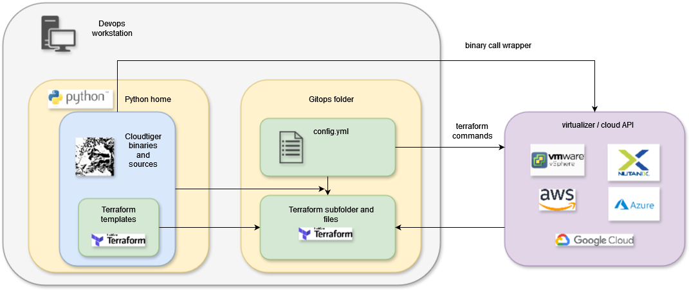
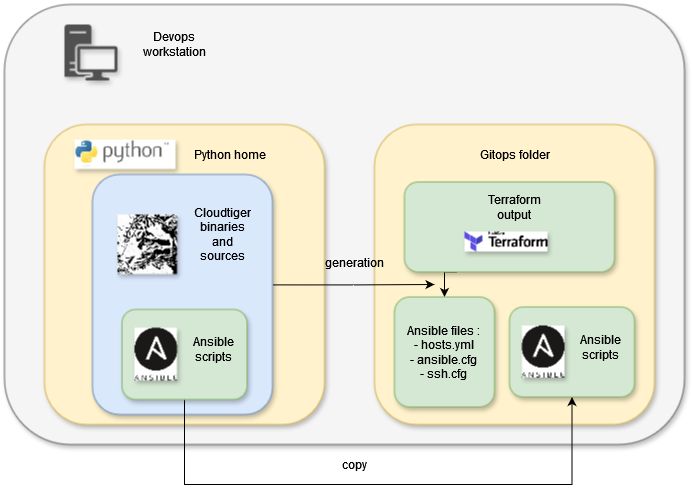

# Cloud Tiger


- [Cloud Tiger](#cloud-tiger)
	- [Cloud Tiger overview](#cloud-tiger-overview)
	- [Quickstart](#quickstart)
		- [Running CloudTiger through Docker](#running-cloudtiger-through-docker)
		- [Execution of basic CloudTiger commands](#execution-of-basic-cloudtiger-commands)
	- [Installation](#installation)
	- [Project configuration](#project-configuration)
	- [Scope configuration](#scope-configuration)
	- [CloudTiger commands](#cloudtiger-commands)
	- [Development](#development)
		- [Modules](#modules)
		- [CLI](#cli)
	- [Debug](#debug)
	- [Backlog](#backlog)

Cloud Tiger is a CLI software, distributed as a python package, that allows to deploy virtual machines on many public and private cloud providers, and to configure them with custom softwares and microservices stack.

Cloud Tiger leverages :

- Terraform for Infrastructure as Code
- Ansible for Configuration Management
- Helm for deployment of Kubernetes stacks

## Cloud Tiger overview

Cloud Tiger embeds scripts and wraps Terraform and Ansible commands to provide the mechanism illustrated below :

The main input of Cloud Tiger is a YAML file called `config.yml` describing the infrastructure you want to create and the software you want to install on this infrastructure.

First, Cloud Tiger makes use of its internal Terraform templates to create a dedicated (and autonomous) Terraform folder with its .tf files, as illustrated below :


Then, Cloud Tiger wraps the Terraform commands to call the infrastructure provider (public or private cloud provider) to instantiate the resources described in `config.yml`, and collect the obtained output (including IP addresses of created VMs), as illustrated below :



Once the infrastructures are created, Cloud Tiger wraps Ansible commands

First, Cloud Tiger parses the Terraform output to extract the IP addresses and generate the files needed by Ansibl to operate (`envt.hosts`, `ssh.cfg`, `ansible.cfg`), as illustrated below. Cloud Tiger also creates a meta-Ansible playbook that will call all the playbooks and roles listed in `config.yml` on the VMs.



Then, Cloud Tiger wraps the Ansible commands to execute the meta-Ansible playbook on the VMs, as illustrated below :


## Quickstart

In order to run a quickstart of CloudTiger on a public cloud provider (AWS, Azure or GCP), you need :

- the technical prerequisites for the chosen cloud provider, instructions [here](doc/prerequisites_cloud_credentials.md)
- a Unix shell
- Docker installed on your workstation

### Running CloudTiger through Docker

Run the following command in the root folder of the CloudTiger project :

```bash
docker build -t cloudtiger .
```

Once you have built and/or pulled the docker, move into a dedicated working directory where you will execute CloudTiger (the tool will dump many dedicated files and folders). Warning : you need writing rights in this directory :

```bash
cd <YOUR_CHOSEN_WORKING_DIRECTORY>
docker run -v "$(pwd)":/workdir -it cloudtiger bash
```

The command above will prompt you a shell command inside the CloudTiger Docker. You can then proceed with the next instructions :

### Execution of basic CloudTiger commands

We are going to create a small environment in your public cloud account, and configure it with a few softwares.

First, let us create a SSH key pair for the demo with the follow command :

```bash
ssh-keygen -q -t rsa -f /workdir/id_rsa -N ''
```

Then, we will setup the CloudTiger root project. Execute the following commands :

```bash
cd /workdir
cloudtiger gitops init folder
cloudtiger gitops init config ### after this command, you will be asked for several credentials information. If you are not sure, do not use a Terraform backend for the demo
cd /workdir/gitops
cloudtiger config/<CHOSEN_CLOUD_PROVIDER>/demo init 0
cloudtiger config/<CHOSEN_CLOUD_PROVIDER>/demo init 1
cloudtiger config/<CHOSEN_CLOUD_PROVIDER>/demo init 2
cloudtiger config/<CHOSEN_CLOUD_PROVIDER>/demo tf init
```

The next command will need you to type 'yes', when asked to create cloud resources :

```bash
cloudtiger config/<CHOSEN_CLOUD_PROVIDER>/demo tf apply
```

You will start to see Terraform logs in your shell.
It will probably take up to 15 minutes for your cloud provider to create all the resources needed.

Once everything is created, Terraform and CloudTiger will give you back the upper hand. You can then proceed with the following instructions :

```bash
cloudtiger config/<CHOSEN_CLOUD_PROVIDER>/demo ans P
cloudtiger config/<CHOSEN_CLOUD_PROVIDER>/demo ans D
cloudtiger config/<CHOSEN_CLOUD_PROVIDER>/demo ans 1 -d
cloudtiger config/<CHOSEN_CLOUD_PROVIDER>/demo ans 2 -d
cloudtiger config/<CHOSEN_CLOUD_PROVIDER>/demo ans H
cloudtiger config/<CHOSEN_CLOUD_PROVIDER>/demo ans 3 -d
```

If everything went smoothly, you now have a dedicated architecture on your chosen cloud provider, with a software stack configured on it !

If you want to delete everything (to avoid unnecessary cloud costs, for example), run this command :

```bash
cloudtiger config/<CHOSEN_CLOUD_PROVIDER>/demo tf destroy
```

Once you have finished, you can leave the CloudTiger docker with this command :

```bash
exit
```

## Installation

To install CloudTiger the way you want, follow the detailed instructions [here](doc/install.md)

## Project configuration

Once you have installed CloudTiger, to create and configure a CloudTiger project, follow the detailed instructions [here](doc/project_configuration.md)

## Scope configuration

Once you have set up your CloudTiger project, prepare a "scope" inside it to start deploying and configuring infrastructures, by following the instructions [here](doc/scope_configuration.md)

## CloudTiger commands

You can find a detailed description of CloudTiger's commands and how to use them to configure infrastructures [here](./doc/commands.md)

## Development

### Modules

If you want to develop Terraform and Ansible modules for CloudTiger, development guidelines are available :

- for [Terraform](./doc/iac_guidelines.md)
- for [Ansible](./doc/cm_guidelines.md)

### CLI

If you want to develop the CloudTiger python package itself, a description of the code's structure is available [here](./doc/code_architecture.md)

## Debug

Various tips for development and debugging can be found [here](./doc/debug.md)

## Backlog

Backlog for requested features [here](./doc/backlog.md)

edition security file in ssh.cfg