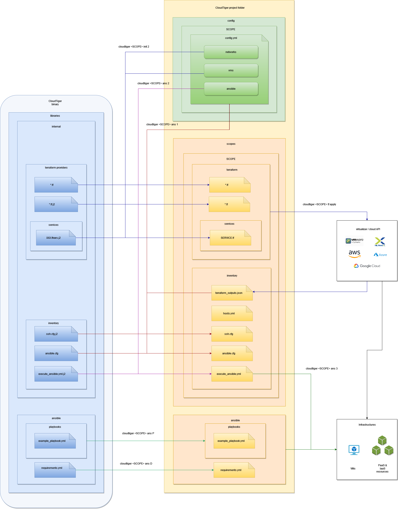

# Code Architecture

The following schema illustrates the operations done by the various CloudTiger commands and the resources involved in the sources of the package



In details :

- the `cloudtiger <SCOPE> init 2` command creates a `<PROJECT_ROOT>/scopes/<SCOPE>/terraform` folder from :
  - the inputs in `<PROJECT_ROOT>/config/<SCOPE>/config.yml`
  - the templates in `cloudtiger/libraries/internal/terraform_providers`
  and it copies Terraform modules from `cloudtiger/libraries/terraform` to `<PROJECT_ROOT>/terraform`
- the `cloudtiger <SCOPE> tf XXX` commands are wrappers on Terraform commands applied on the folder `<PROJECT_ROOT>/scopes/<SCOPE>/terraform`
- the `cloudtiger <SCOPE> ans 1` command creates a `<PROJECT_ROOT>/scopes/<SCOPE>/inventory` folder from :
  - the inputs in `<PROJECT_ROOT>/config/<SCOPE>/config.yml`
  - the templates in `cloudtiger/libraries/internal/inventory`
- the `cloudtiger <SCOPE> ans P` copies Ansible playbooks from `cloudtiger/libraries/ansible/playbooks` to `<PROJECT_ROOT>/ansible/playbooks`
- the `cloudtiger <SCOPE> ans D` merges Ansible requirement files from `cloudtiger/libraries/ansible/requirements.yml` and `<PROJECT_ROOT>/standard/ansible_requirements.yml` into `<PROJECT_ROOT>/ansible/requirements.yml`
- the `cloudtiger <SCOPE> ans 2` command creates a `<PROJECT_ROOT>/scopes/<SCOPE>/inventory/execute_ansible.yml` folder from the inputs in `<PROJECT_ROOT>/config/<SCOPE>/config.yml`
- the `cloudtiger <SCOPE> ans 3` command executes the Ansible playbook `<PROJECT_ROOT>/scopes/<SCOPE>/inventory/execute_ansible.yml`

## Files

```bash
cloudtiger
├── ans.py	# code of the "ans" command
├── cli.py	# CLI options management
├── cloudtiger.py # definition of the Operation class, that manages most of the parameters of the CloudTiger operations
├── common_tools.py # recurrent functions
├── data.py # some static variables
├── helper.py # the helpers of the CLI as text (for test execution purposes)
├── init.py # code of the "init" command
├── libraries # libraries folder
│   ├── ansible # all about Ansible
│   │   ├── playbooks # list of embedded Ansible playbooks
│   │   │   ├── configure_users_standard.yml
│   │   │   ├── deploy_docker_compose.yml
│   │   │   ├── edit_hosts.yml
│   │   │   ├── edit_hosts_by_groups.yml
│   │   │   ├── update_hostname.yml
│   │   │   └── upload_files.yml
│   │   └── requirements.yml
│   ├── internal # some files needed by the operations
│   │   ├── gitops # contains the CloudTiger project folder template
│   │   ├── inventory # templates for creating the 'inventory' folder
│   │   │   ├── ansible.cfg
│   │   │   ├── ansible_nocheck.cfg
│   │   │   ├── execute_ansible.yml.j2
│   │   │   ├── ssh.cfg.j2
│   │   │   ├── ssh_os_user.cfg.j2
│   │   │   ├── ssh_with_proxy.cfg.j2
│   │   │   └── ssh_with_proxy_os_user.cfg.j2
│   │   ├── standard # standard values for Terraform variables files
│   │   │   ├── disk_standard.yml
│   │   │   ├── firewall_standard.yml
│   │   │   └── vm_standard.yml
│   │   ├── terraform_providers # templates for creating the 'terraform' folder
│   │   │   ├── main.tf
│   │   │   ├── modules.tf.j2
│   │   │   ├── outputs.tf.j2
│   │   │   ├── provider.tf.j2
│   │   │   ├── services
│   │   │   │   ├── kubernetes.tfvars.j2
│   │   │   │   ├── network.tfvars.j2
│   │   │   │   ├── policy.tfvars.j2
│   │   │   │   ├── profile.tfvars.j2
│   │   │   │   ├── role.tfvars.j2
│   │   │   │   └── vm.tfvars.j2
│   │   │   ├── terraform.tfvars.j2
│   │   │   └── variables.tf
│   │   └── terraform_services # templates for creating the '<SERVICE_NAME>' folders
│   │       ├── gitlab
│   │       │   └── main.tf.j2
│   │       └── nexus
│   │           └── main.tf.j2
│   └── terraform # catalog of Terraform modules per provider or service
│       ├── providers
│       │   ├── aws
│       │   ├── azure
│       │   ├── gcp
│       │   ├── nutanix
│       │   └── vsphere
│       └── services
│           ├── gitlab
│           └── nexus
├── service.py # code of the "service" command
├── specific # for specific functions per cloud provider
│   └── nutanix.py
└── tf.py # code of the "tf" command
```