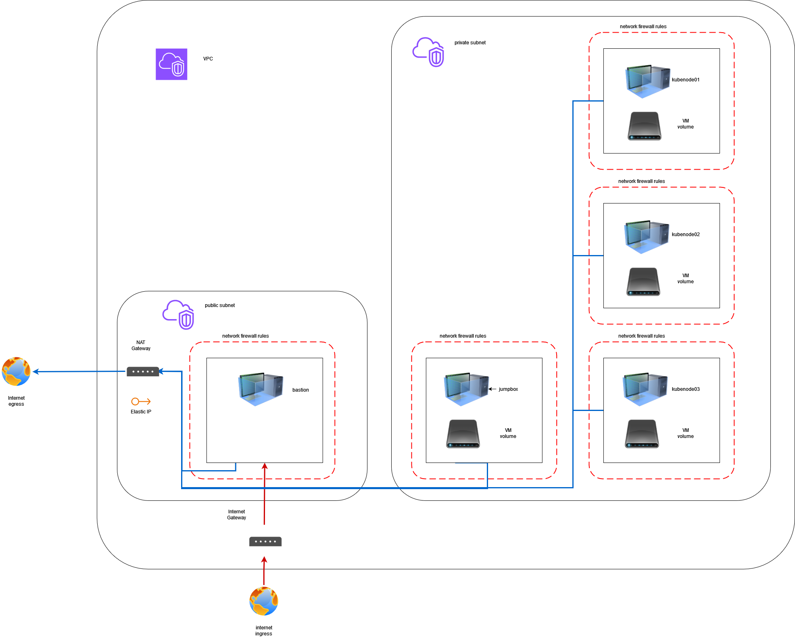

# Platform deployment

CloudTiger provides templates to create and configure complete Kubernetes cluster loaded with common softwares installed through Helm. Such a cluster will be referenced as a "platform"

The architecture of a platform is the following one :

- a private subnet hosting :
  - a set of VMs used as the nodes of a Kubernetes cluster
  - a "jumpbox", a technical VM used as a proxy to interact easily with the Kubernetes cluster
- a public subnet hosting a proxy, that manages the public access to the Kubernetes cluster

The architecture is summarized in this schema :



## Platform manifest

Platform manifests are by default stored in your CloudTiger's project root folder in the folder `manifests`. The `cloudtiger <PROJECT_ROOT> init F` command will provide you a working example when creating your root folder.

### Generating the deploy manifest

When you run the command

```bash
cloudtiger <PROJECT_ROOT> config G --platform
```

CloudTiger will prompt you to choose a manifest folder, that will be `manifests` by default, then scan this folder for `.yml` files, and ask you to choose between those he found.

Then, CloudTiger will prompt you a long list of questions to help you configure your platform, according to platform info described in the manifest file.

At the end of the prompts, CloudTiger will create a scope folder in your `<PROJECT_ROOT>/config` folder and a Deploy manifest called `deploy.yml` in this scope folder.

### Generating the config file

When you run the command

```bash
cloudtiger config/<YOUR_SCOPE> config D
```

CloudTiger will prompt you to choose an ansible templates folder, that will be `manifests` by default too, then scan this folder for `.yml.j2` files, and ask you to choose between those he found.

Once you have chosen, CloudTiger will ask you if you want an "internal" or "external" deployment.

- The "external" deployment is the default deployment corresponding to the architecture illustrated above
- Choose an "internal" deployment if you want to deploy the platform inside a more complex architecture where your resources are not directly reached from public interne

At the end of the prompts, CloudTiger will create a `config.yml` file in your `<PROJECT_ROOT>/config` using data from `<PROJECT_ROOT>/config/deploy.yml` and from the ansible template you chose.

## Deploy the platform

Once you have a scope folder and a `config.yml` file for it, you can proceed to create your platform.

Keep these variables :

```bash
export PROVIDER_NAME=aws # set your chosen value
export CUSTOMER_NAME=dataplatform # set your chosen value
export ENVIRONMENT_NAME=demo # set your chosen value
```

### Infrastructure creation

Get the list of IP addresses :

```bash
cloudtiger config/$PROVIDER_NAME/customers/$CUSTOMER_NAME/$ENVIRONMENT_NAME init 1
```

If the command runs correctly, it should have generated a file `config/$PROVIDER_NAME/customers/$CUSTOMER_NAME/$ENVIRONMENT_NAME/config_ips.yml` containing the IP addresses that will be attributed to the VMs you will create.

You can check the content of the file `config/$PROVIDER_NAME/customers/$CUSTOMER_NAME/$ENVIRONMENT_NAME/config_ips.yml` :

```bash
cat config/$PROVIDER_NAME/customers/$CUSTOMER_NAME/$ENVIRONMENT_NAME/config_ips.yml
```

Prepare Terraform folder with templated `*.tf` files :

```bash
cloudtiger config/$PROVIDER_NAME/customers/$CUSTOMER_NAME/$ENVIRONMENT_NAME init 2
```

If the command runs correctly, it should have generated a folder `scopes/$PROVIDER_NAME/customers/$CUSTOMER_NAME/$ENVIRONMENT_NAME/terraform`

Prepare the Terraform driver :

```bash
cloudtiger config/$PROVIDER_NAME/customers/$CUSTOMER_NAME/$ENVIRONMENT_NAME tf init
```

If the command runs correctly, it should have generated a folder `scopes/$PROVIDER_NAME/customers/$CUSTOMER_NAME/$ENVIRONMENT_NAME/terraform/.terraform`

Create the VMs :

```bash
cloudtiger config/$PROVIDER_NAME/customers/$CUSTOMER_NAME/$ENVIRONMENT_NAME tf apply
```

If the command runs correctly, it should prompt you a yes/no question about actually creating the resources. Prompt EXACTLY "yes" if you want to proceed. The nutanix cluster should take a few minutes to boot your resources.

If Terraform succeeds to create the resources, you will see a lot of logs in HCL format describing the resources you just created.

### Configuration Management

Generate the ansible folder :

```bash
cloudtiger config/$PROVIDER_NAME/customers/$CUSTOMER_NAME/$ENVIRONMENT_NAME ans 1 -d -nc
```

If the command runs correctly, it should have generated a folder `scopes/$PROVIDER_NAME/customers/$CUSTOMER_NAME/$ENVIRONMENT_NAME/inventory` containing files `ansible.cfg`, `hosts.yml`, `ssh.cfg`

#### SSH fingerprints

The `-nc` option in `ans 1` means that ansible __will NOT check__ SSH fingerprints at connection. If you want to enforce checking, you will need to use this command before going further, that add newly created VMs to your local `known_hosts` file, clear previous SSH fingerprints if necessary :

```bash
cloudtiger config/$PROVIDER_NAME/customers/$CUSTOMER_NAME/$ENVIRONMENT_NAME ans H
```

#### default OS user

The `-d` option in `ans 1` means that ansible will use the default user associated with the OS image deployed on the VM for SSH connection.

#### Installing Ansible dependencies

Install the embedded Ansible roles necessary for installing the plaform

```bash
cloudtiger config/$PROVIDER_NAME/customers/$CUSTOMER_NAME/$ENVIRONMENT_NAME ans R
```

Install the embedded Ansible playbooks necessary for installing the plaform

```bash
cloudtiger config/$PROVIDER_NAME/customers/$CUSTOMER_NAME/$ENVIRONMENT_NAME ans P
```

#### Extending VMs root logical volumes

The next commands allows you to extend the root logical volumes of the VMs you just created. Run these commands :

```bash
cloudtiger config/$PROVIDER_NAME/customers/$CUSTOMER_NAME/$ENVIRONMENT_NAME ans 2
cloudtiger config/$PROVIDER_NAME/customers/$CUSTOMER_NAME/$ENVIRONMENT_NAME ans 3
```

You can now connect to the VMs to check their partitions' size :

```bash
ssh -F scopes/$PROVIDER_NAME/customers/$CUSTOMER_NAME/$ENVIRONMENT_NAME/inventory/ssh.cfg <VM_NAME_IN_SSH_CONFIG> ### choose the name of the VM you want to reach in the ssh.cfg file
```

```bash
df -h
```

Then `exit` to go back to your local host.

#### Installing Kubernetes prerequisites

Next commands will run the role `k8s-docker` and `haproxy-exposition` installing docker in a well-chosen version, and all packages to run `longhorn` as Persistant Volume Manager, along with HA Proxy on your bastion host for public exposition.

```bash
cloudtiger config/$PROVIDER_NAME/customers/$CUSTOMER_NAME/$ENVIRONMENT_NAME ans 2 -a ansible-kubernetes-prerequisites
cloudtiger config/$PROVIDER_NAME/customers/$CUSTOMER_NAME/$ENVIRONMENT_NAME ans 3
```

#### Installing Kubernetes

Next commands will run the roles `k8s-rke`, `k8s-dashboard`, installing RKE, a K8s dashboard Helm Chart, and pre-pulling Longhorn docker images on all nodes.

```bash
cloudtiger config/$PROVIDER_NAME/customers/$CUSTOMER_NAME/$ENVIRONMENT_NAME ans 2 -a ansible-kubernetes
cloudtiger config/$PROVIDER_NAME/customers/$CUSTOMER_NAME/$ENVIRONMENT_NAME ans 3
```

At the end of the role, Ansible should dump you two files : 

- `gitops/scopes/$PROVIDER_NAME/customers/$CUSTOMER_NAME/$ENVIRONMENT_NAME/inventory/kubernetes-dashboard-address.txt` : this file contains the address of the master node of the cluster with the port of the exposed K8s Dashboard
- `gitops/scopes/$PROVIDER_NAME/customers/$CUSTOMER_NAME/$ENVIRONMENT_NAME/inventory/kubernetes-dashboard-token.txt` : this file contains the admin token to connect to the K8s Dashboard

#### Installing Base Platform services

Next commands will run the role `k8s-platform`, installing all 3rd party services of the BT Platform

```bash
cloudtiger config/$PROVIDER_NAME/customers/$CUSTOMER_NAME/$ENVIRONMENT_NAME ans 2 -a ansible-dataplatform
cloudtiger config/$PROVIDER_NAME/customers/$CUSTOMER_NAME/$ENVIRONMENT_NAME ans 3
```

At the end of the role, Ansible should dump you a Markdown file in this folder : `gitops/scopes/$PROVIDER_NAME/customers/$CUSTOMER_NAME/$ENVIRONMENT_NAME/inventory/dataplatform.md`. This file contains all URLs and credentials to all 3rd party services of the platform.

## Manifest structure

You can have a look of an example of a manifest file [here](../cloudtiger/libraries/internal/gitops/manifests/dataplatform-manifest.yml).

